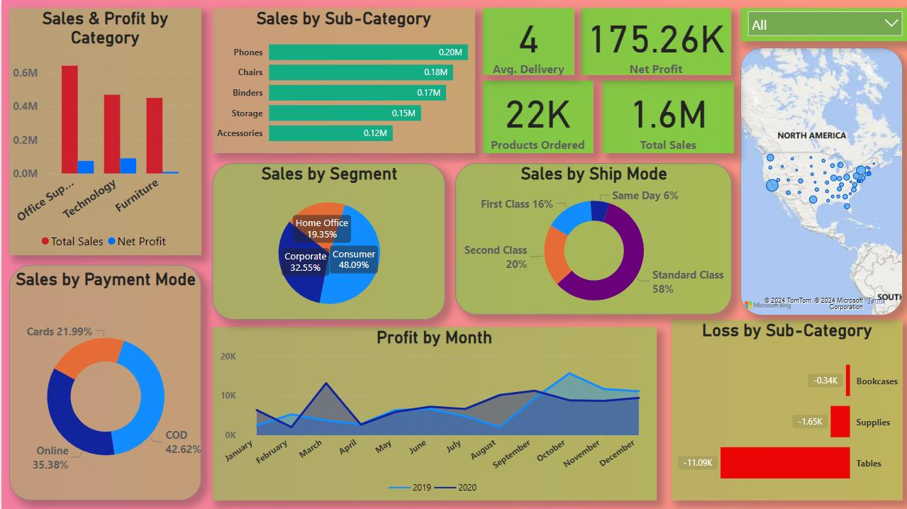
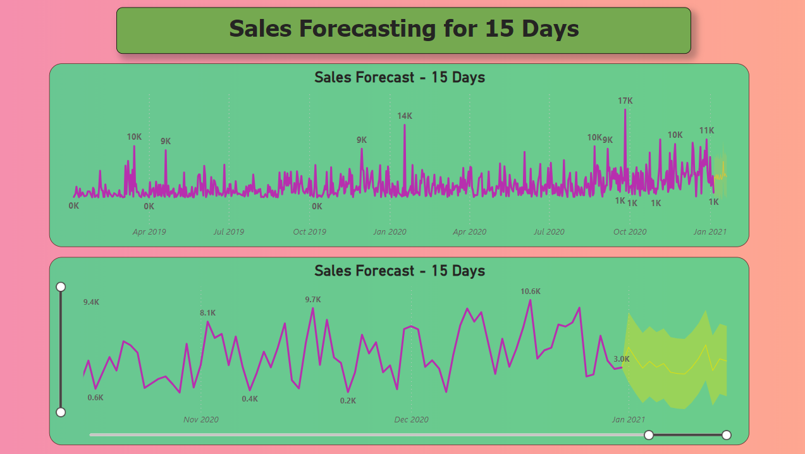

📊 Project Overview: Online Super Store Analysis

I analyzed a dataset of an online super store, I crafted insightful dashboards and leveraged advanced analytics to drive strategic decisions.

🔍 Project Highlights:

I explored a diverse dataset including order details, customer information, and product sales to develop a comprehensive dashboard offering insights into sales trends, profitability, and customer behavior.

🔧 Skills Used:

- Data Visualization: Developed visually appealing charts and maps to present sales and profit data.

- Advanced Analytics: Utilized DAX queries to perform calculations and sales forecasting, enabling deeper insights into business trends.

- Data Transformation: Employed Power Query to clean and transform raw data for analysis, ensuring data accuracy and consistency.

- Interactive Dashboards: Created dynamic slicers for exploring data from different perspectives, enhancing user experience and interactivity.

- DAX Expertise: Leveraged advanced DAX functions to manipulate and analyze data efficiently, unlocking valuable insights for decision-making.

- Power Query Proficiency: Utilized Power Query techniques to reshape and clean data sources, optimizing data preparation processes for analysis.

You can check out the project on LinkedIn here: https://lnkd.in/e_nG2KEX
